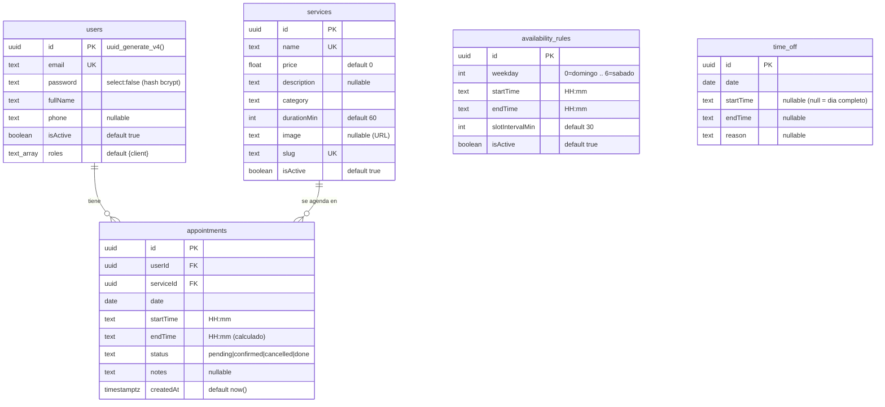

# Luné by Kelin — Backend

> **Código de Verificación:** `LEARN-CAP-F997E70D`
> **Repositorio:** https://github.com/jespinal899/luneBy (carpeta `backend/`)

API REST para **Luné by Kelin**, un estudio profesional de manicura: catálogo de
servicios, cálculo de disponibilidad y agendado de citas por franjas horarias.

Este backend se construye de forma incremental, un commit por cambio.

## Endpoints

| Método | Ruta | Acceso |
| :--- | :--- | :--- |
| `POST` | `/api/auth/register` | Público |
| `POST` | `/api/auth/login` | Público |
| `GET` | `/api/auth/check-status` | Autenticado |
| `GET` | `/api/services` | Público (query: `page`, `limit`, `q`, `categorias`, `price`, `minPrice`, `maxPrice`) |
| `GET` | `/api/services/:idOslug` | Público |
| `POST` `PATCH` `DELETE` | `/api/services[/:id]` | Admin |
| `GET` | `/api/appointments/availability?date=&serviceId=` | Público |
| `POST` | `/api/appointments` | Autenticado |
| `GET` | `/api/appointments/me` | Autenticado |
| `PATCH` | `/api/appointments/:id/cancel` | Autenticado (dueño) |
| `GET` | `/api/appointments?date=&status=` | Admin |
| `PATCH` | `/api/appointments/:id/status` | Admin |

Detalle interactivo en `/api/docs`.

---

## Stack

| Capa | Tecnología |
| :--- | :--- |
| Runtime | Node.js ≥ 20 |
| Framework | NestJS 10 |
| ORM | TypeORM 0.3 |
| Base de datos | PostgreSQL 16 |
| Autenticación | JWT (Passport) + bcrypt |
| Validación | class-validator / class-transformer |
| Tests | Jest + Supertest |
| CI | GitHub Actions |

---

## Arquitectura

Módulos por dominio, cada uno con su entidad, DTOs, servicio y controlador:

```
src/
├── main.ts                 # bootstrap, prefijo /api, ValidationPipe global
├── app.module.ts           # ConfigModule + TypeOrmModule + módulos de dominio
├── common/                 # PaginationDto y utilidades compartidas
├── auth/                   # usuarios, registro/login, JWT, roles
├── services/               # catálogo de servicios de manicura
└── appointments/           # reglas de disponibilidad, bloqueos y citas
```

El esquema y los datos base viven en `../supabase/migrations/` (SQL, aplicadas
con la CLI de Supabase). La API solo se conecta: nunca usa `synchronize` ni
aplica migraciones al arrancar.

---

## Modelo de datos

El esquema se define en `../supabase/migrations/0001_esquema_inicial.sql`. Las
entidades de TypeORM lo reflejan para las consultas (nunca lo generan).



| Relación | Cardinalidad | Clave |
| :--- | :--- | :--- |
| `users` → `appointments` | 1 : N | `appointments.userId` |
| `services` → `appointments` | 1 : N | `appointments.serviceId` |
| `availability_rules`, `time_off` | *sin FK* | parámetros del calendario; los lee el cálculo de disponibilidad |

Índices: `UNIQUE` en `users.email`, `services.name`, `services.slug`; índice
compuesto `(date, startTime)` en `appointments`.

---

## Puesta en marcha (desarrollo)

Requisitos: Node.js ≥ 20, Docker.

```bash
cd backend
# Crea el archivo .env con las variables de la tabla de abajo
npm install
docker compose up -d          # PostgreSQL local en el puerto 5432

# Aplica esquema + datos base al Postgres local (una vez):
psql "$DATABASE_URL" -f ../supabase/migrations/0001_esquema_inicial.sql
psql "$DATABASE_URL" -f ../supabase/migrations/0002_datos_demo.sql
# (o, con la CLI de Supabase: `supabase db reset`)

npm run start:dev             # API en http://localhost:3001/api
```

- API: `http://localhost:3001/api`
- Documentación OpenAPI (Swagger): `http://localhost:3001/api/docs`
- Usuarios de ejemplo (los crea `0002_datos_demo.sql`): admin
  `kelin@luneby.com` / clienta `cliente@test.com`, ambos `Abc123`

> El repositorio **no versiona ningún archivo `.env`** (ni plantillas). Crea tu
> propio `.env` a partir de la tabla siguiente.

### Variables de entorno

| Variable | Ejemplo | Descripción |
| :--- | :--- | :--- |
| `STAGE` | `dev` | `dev` o `prod`. En `prod` se activa SSL en PostgreSQL. |
| `PORT` | `3001` | Puerto HTTP de la API. |
| `FRONTEND_URL` | `http://localhost:5173` | Origen(es) permitido(s) por CORS, separados por coma. |
| `DB_HOST` | `localhost` | Host de PostgreSQL (ignorado si hay `DATABASE_URL`). |
| `DB_PORT` | `5432` | Puerto de PostgreSQL. |
| `DB_NAME` | `LuneByDB` | Nombre de la base de datos. |
| `DB_USERNAME` | `postgres` | Usuario de PostgreSQL. |
| `DB_PASSWORD` | *(elige uno local)* | Contraseña de PostgreSQL. |
| `DATABASE_URL` | *(vacío en local)* | Connection string completa; tiene prioridad sobre las `DB_*` (se usa en prod con el pooler de Supabase). |
| `JWT_SECRET` | *(cadena larga aleatoria)* | Firma de los JSON Web Tokens. |
| `JWT_EXPIRES_IN` | `2h` | Caducidad de los tokens. |
| `HOST_API` | `http://localhost:3001/api` | URL pública de la API (para las imágenes servidas desde disco). |
| `SUPABASE_URL` | *(vacío en local)* | `https://<ref>.supabase.co`. Si está, las imágenes van a Supabase Storage en vez de al disco. |
| `SUPABASE_SERVICE_ROLE_KEY` | *(vacío en local)* | Clave `service_role` de Supabase (secreta). |
| `SUPABASE_STORAGE_BUCKET` | `service-images` | Bucket público donde se guardan las imágenes. |

Genera un `JWT_SECRET`:

```bash
node -e "console.log(require('crypto').randomBytes(48).toString('hex'))"
```

---

## Scripts

| Comando | Descripción |
| :--- | :--- |
| `npm run start:dev` | Servidor en watch mode. |
| `npm run build` | Compila a `dist/`. |
| `npm run start:prod` | Ejecuta `dist/main`. |
| `npm test` | Tests unitarios (Jest). |
| `npm run test:cov` | Tests con cobertura. |
| `npm run test:e2e` | Tests end-to-end. |
| `npm run lint` | ESLint + Prettier. |

---

## Tests

- Unitarios: `src/**/*.spec.ts`
- End-to-end: `test/**/*.e2e-spec.ts`

```bash
npm test
```

La integración continua (`.github/workflows/backend-ci.yml`) compila y ejecuta los
tests en cada push o pull request que toque `backend/`.

---

## Migraciones

El esquema y los datos base se versionan como SQL en
[`../supabase/migrations/`](../supabase/migrations/) y se aplican con la **CLI de
Supabase** (`supabase db push`). La API nunca usa `synchronize` ni aplica
migraciones al arrancar; solo se conecta.

```bash
supabase migration new descripcion_del_cambio   # crea supabase/migrations/NNNN_*.sql
# edita el .sql (SQL idempotente: if not exists, on conflict, ...)
supabase db push                                 # aplica las pendientes
```

Ver [`../supabase/README.md`](../supabase/README.md).

## Producción

Base de datos en **Supabase**, API en **Render**. Guía completa en
[`DEPLOY.md`](./DEPLOY.md).

Con `STAGE=prod`: SSL en PostgreSQL y CORS restringido a `FRONTEND_URL`. Usa un
`JWT_SECRET` propio y de alta entropía.

## Hoja de ruta

- [x] Scaffold NestJS
- [x] Conexión a PostgreSQL (TypeORM)
- [x] Módulo common (paginación)
- [x] Auth (registro / login / JWT + roles)
  - [x] Entidad `User` y roles
  - [x] DTOs e interfaces
  - [x] Estrategia JWT y Passport
  - [x] Endpoints de registro y login
  - [x] Protección de rutas por roles (`@Auth`, `@GetUser`, `UserRoleGuard`)
- [x] Services (catálogo con filtros de categoría y precio + CRUD admin)
- [x] Appointments (disponibilidad + agendado por slots + gestión admin)
- [x] Documentación OpenAPI (`/api/docs`) y CORS por entorno
- [x] helmet + rate limiting
- [x] Subida de imágenes de servicios a Supabase Storage
- [x] Migraciones SQL con la CLI de Supabase (`../supabase/migrations/`)
- [x] Despliegue en Supabase + Render (ver `DEPLOY.md`)
