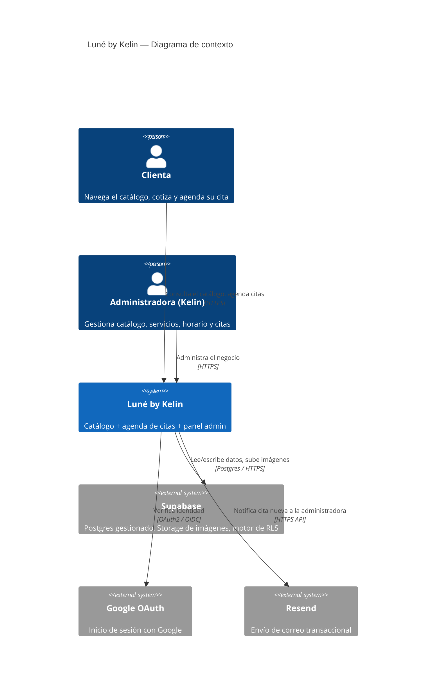
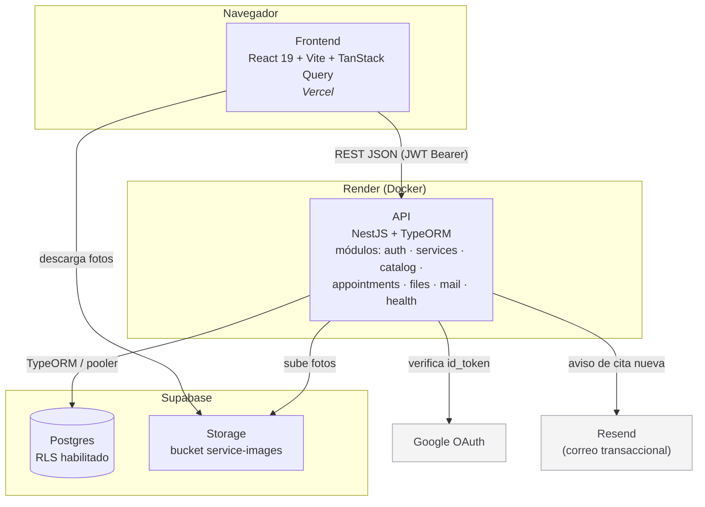

# Arquitectura — Luné by Kelin

Estudio de uñas: catálogo de diseños, agenda de citas en línea y panel de
administración. Documentado con el modelo **C4** (Contexto → Contenedores),
reflejando el estado real del repositorio, no un diseño aspiracional.

## Nivel 1 — Contexto

Quién usa el sistema y con qué sistemas externos habla.

## Nivel 2 — Contenedores

Cómo se reparte el sistema en piezas desplegables, y dónde vive cada una.

### Contenedores y responsabilidad

| Contenedor | Tecnología | Responsabilidad |
|---|---|---|
| Frontend | React 19, Vite, React Router, TanStack Query, Tailwind | Sitio público (catálogo, agenda), panel admin, autenticación de cliente |
| API | NestJS 10, TypeORM 0.3, `pg` | Reglas de negocio, autenticación (JWT propio + Google), autorización por rol, orquestación con Supabase Storage y Resend |
| Postgres | Supabase (gestionado) | Persistencia. 15 migraciones SQL versionadas en `supabase/migrations/`. RLS habilitado en las tablas expuestas por PostgREST |
| Storage | Supabase Storage | Fotos de servicios y diseños del catálogo (bucket público `service-images`) |
| Google OAuth | Servicio externo | Inicio de sesión alternativo a email/contraseña |
| Resend | Servicio externo | Correo a la administradora cuando se agenda una cita nueva |

### Módulos del backend (Nivel 3 — componentes, resumido)

- **auth** — registro, login (contraseña y Google), JWT, guards por rol (`admin`/`client`)
- **services** — catálogo de servicios agendables (nombre, precio, duración)
- **catalog** — entradas visuales del catálogo público; cada una referencia un `service` y hereda su precio/duración
- **appointments** — disponibilidad, reserva, horario semanal (`ScheduleService`), bloqueos de agenda (`TimeOffService`)
- **files** — subida de imágenes (Supabase Storage o disco local según configuración)
- **mail** — aviso por correo de citas nuevas, desacoplado vía evento de dominio (`appointment.created`) y una interfaz `MailSender` (hoy implementada con Resend)
- **common** — filtros, interceptores (idempotencia, caché) y DTOs compartidos

### Decisiones relevantes

Las decisiones de arquitectura con más peso quedan documentadas como ADRs en
[`docs/adr/`](./adr):

- [ADR-001 — Persistencia de datos](./adr/ADR-001-persistencia.md)
- [ADR-002 — Autenticación propia (JWT) en vez de Supabase Auth](./adr/ADR-002-autenticacion.md)
